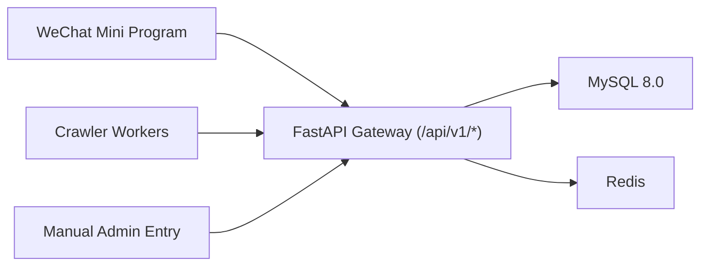

# Kaoyan Miniapp MVP Docs

This repo is a fresh implementation for:
- WeChat Mini Program frontend
- Python FastAPI backend
- MySQL 8.0 + Redis
- Crawler-ready ingestion pipeline

## Architecture Overview



## Environment Requirements

- Python 3.10+
- Node.js 18+
- Docker Compose v2+
- WeChat DevTools (for miniapp debug)

## Quick Start (Local)

1. Clone and enter project:
```bash
git clone <your-repo-url>
cd kaoyan-miniapp-mvp
```

2. Start infra:
```bash
docker compose -f infra/docker-compose.yml up -d db redis
```

3. Run backend:
```bash
cd backend
cp .env.example .env
pip install -r requirements.txt
python -m alembic upgrade head
uvicorn app.main:app --reload --host 0.0.0.0 --port 8000
```

4. Seed Week 4 sources (20 schools):
```bash
cd backend
python scripts/seed_sources.py
```

5. Run miniapp:
- Open `miniapp/` with WeChat DevTools.
- Keep default no-popup silent login flow via `wx.login`.
- For local-only flow without WeChat secret, set `USE_MOCK_WECHAT=true` in `backend/.env`.

## Test-Version Smoke Run (Local App + Remote MySQL)

Use this when backend runs locally but DB is remote:

```bash
cd backend
export DATABASE_URL="mysql+pymysql://<user>:<urlencoded_password>@<host>:<port>/<db>?charset=utf8mb4"
export USE_MOCK_WECHAT=true
export WECHAT_APPID=mock
export WECHAT_SECRET=mock
export SECRET_KEY=dev-secret
export AUTO_CREATE_TABLES=false
python -m alembic upgrade head
python scripts/smoke_test_version.py
```

Password note:
- If password contains `@` or `!`, URL-encode it first (for example `@` -> `%40`, `!` -> `%21`).

## Core Docs Index

- [Backend and Crawler Spec](./backend_and_crawler.md)
- [Frontend and Design Spec](./frontend_and_design.md)
- [Deployment Handbook](./deployment.md)
- [Git Workflow and Release Rules](./git_workflow.md)
- [PR Draft: dev -> main](./pr_dev_to_main.md)
