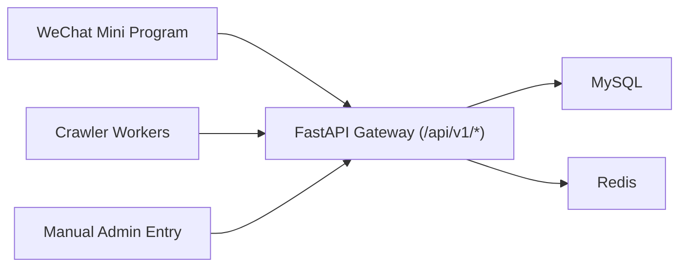

# 格物简录 Miniapp MVP Docs

This repo is a fresh implementation for:
- WeChat Mini Program frontend
- Python FastAPI backend
- External MySQL + Redis
- Crawler-ready ingestion pipeline

## Architecture Overview



## Environment Requirements

- Python 3.10+
- Node.js 18+
- External MySQL access
- WeChat DevTools (for miniapp debug)

## Quick Start (Local)

1. Clone and enter project:
```bash
git clone <your-repo-url>
cd gewujl
```

2. Start optional local Redis:
```bash
docker compose -f infra/docker-compose.yml up -d redis
```

3. Prepare backend env:
```bash
cd backend
cp .env.example .env
```

4. Install dependencies and run backend:
```bash
python3 -m venv .venv
. .venv/bin/activate
pip install -r backend/requirements.txt
npm install
npm run dev:backend
```

5. Run miniapp:
- Open `miniapp/` with WeChat DevTools.
- Keep default no-popup silent login flow via `wx.login`.

## Core Docs Index

- [Development Protocol](./development_protocol.md)
- [Development Plan](./plan.md)
- [Backend and Crawler Spec](./backend_and_crawler.md)
- [Frontend and Design Spec](./frontend_and_design.md)
- [Deployment Handbook](./deployment.md)
- [Git Workflow and Release Rules](./git_workflow.md)
