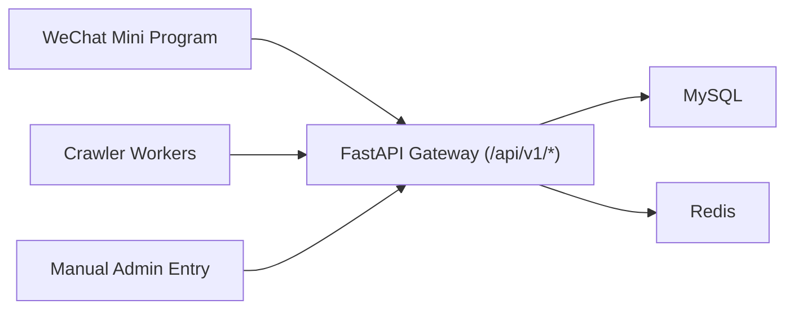

# 格物简录文档总览

这里是项目的文档入口，覆盖开发规范、架构、部署与发布流程。

## 先读这 3 份

1. [Development Protocol](./development_protocol.md)
2. [Git Workflow and Release Rules](./git_workflow.md)
3. [Deployment Handbook](./deployment.md)

## 架构说明



## 本地开发最短路径

```bash
git clone <your-repo-url>
cd gewujl
python3 -m venv .venv
. .venv/bin/activate
pip install -r backend/requirements.txt
npm install
cp backend/.env.example backend/.env
npm run dev:backend
```

小程序在微信开发者工具打开 `miniapp/` 即可。

## 文档目录

- [Development Protocol](./development_protocol.md)
- [Development Plan](./plan.md)
- [Backend and Crawler Spec](./backend_and_crawler.md)
- [Frontend and Design Spec](./frontend_and_design.md)
- [Deployment Handbook](./deployment.md)
- [Git Workflow and Release Rules](./git_workflow.md)
- [注册登录架构（Portal 用户）](./auth_login_architecture.md)
- [服务器版本记录（2026-03-17）](./server_release_2026-03-17.md)
- [Web UI 接口对齐说明（2026-03-17）](./web_ui_api_alignment_2026-03-17.md)
