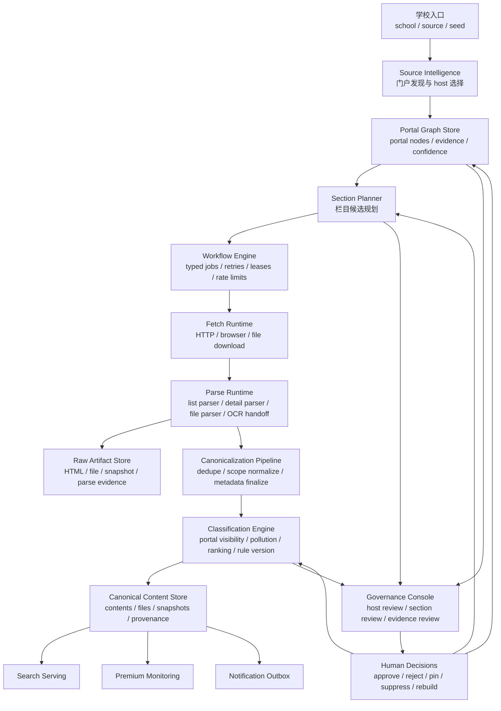

# 爬虫 V2 完全迁移总体架构（2026-03-26）

本文档不是在现有 V1 上继续补几条规则，而是定义“完全迁移完成后”的目标形态。

它回答 4 个问题：

1. V2 完成后，整套爬虫系统应该长什么样
2. 当前 V1 里哪些东西必须保留
3. 哪些执行层和规则层必须重做
4. 要完成一次彻底迁移，需要做哪些改造

## 1. 结论先行

这次迁移不建议推翻当前业务模型。

必须保留的核心抽象仍然是：

- `学校 / 院系`
- `门户与栏目资产`
- `栏目发现产物`
- `规范化内容`
- `内容可见性与污染治理`
- `搜索 / 监控 / 通知复用同一份内容资产`

真正要重做的是：

- worker 执行内核
- 抓取任务模型
- 规则组织方式
- 证据与解释系统
- 后台治理入口

一句话概括：

- `保留领域模型，重做执行架构`

## 2. V2 目标

V2 不是做一个“更快的网页抓取器”，而是做一个可运营的高校研招内容生产平台。

迁移完成后应满足：

- 学校级与院系级公告、调剂、附件抓取走统一工作流
- 门户发现、栏目发现、详情抓取、文件解析、可见性判定各自独立
- 每条抓取结果都有结构化证据、置信度、规则版本和解释文本
- 搜索只消费“已归一化、已判定”的资产，不承担主路径修复职责
- 监控、通知、后台治理都复用同一套内容判定结果
- 单个学校、单个 host、单个栏目都可以独立重跑、隔离、回滚和审计

## 3. 设计原则

- 领域优先：系统围绕“研招门户与栏目资产”设计，不退化成通用网页爬虫。
- 分层执行：抓取、解析、归一化、判定、服务消费必须解耦。
- 证据优先：任何 host、section、content 的结论都必须能回溯到证据。
- 强类型任务：不同 job 类型必须有独立输入、输出、重试和幂等语义。
- 渐进治理：自动规则负责筛选，后台负责解释、复核和沉淀治理结果。
- 生产安全：新旧系统允许并行，最终由资产和内容级切换完成完全迁移。

## 4. V2 总体架构图

## 5. V2 逻辑分层

### 5.1 Source Intelligence

职责：

- 从学校首页、搜索 seed、历史内容、手工 override 中识别候选门户
- 决定 `preferred_hosts`
- 识别学校级门户、分校、独立学院、院系站和噪音站点
- 维护 portal graph，而不是只返回若干 URL

输出：

- `portal_nodes`
- `portal_edges`
- `host_confidence`
- `selection_reason`
- `conflict_signals`

对应 V1 主要来源：

- `backend/app/services/school_cold_start.py`
- `backend/app/services/announcement_portal.py`

### 5.2 Section Planner

职责：

- 基于 portal graph 选择应当探测的栏目入口页
- 区分 `admissions / notice / adjustment / supplemental`
- 决定每个 section 的证据来源、优先级和可复用性

输出：

- `section candidates`
- `probe strategy`
- `section family`
- `expected parser profile`

对应 V1 主要来源：

- `backend/app/services/site_section_bootstrap.py`
- `backend/app/services/site_section_probe.py`

### 5.3 Workflow Engine

职责：

- 将任务从泛型 JSON job 改为强类型 workflow step
- 统一 lease、重试、退避、超时、幂等和依赖关系
- 按 host / school / priority / freshness 调度

建议任务类型：

- `portal_discovery`
- `portal_reverify`
- `section_discovery`
- `section_reprobe`
- `detail_fetch`
- `detail_refetch`
- `file_fetch`
- `file_parse`
- `ocr_enqueue`
- `content_reclassify`
- `pollution_cleanup`
- `backfill_rebuild`

对应 V1 主要来源：

- `backend/app/services/crawler.py`
- `backend/app/main.py`

### 5.4 Fetch Runtime

职责：

- 只负责拿到网页或文件
- 不负责业务判定
- 对静态页、CSR 页、文件下载做统一抓取抽象

能力：

- host 级限流
- UA 策略
- cookie/session 隔离
- browser fallback
- 文件流式下载

### 5.5 Parse Runtime

职责：

- 把抓到的页面解析成结构候选
- 分为 list parser、detail parser、file parser 三类
- 产生“解析证据”，而不是直接决定可见性

输出：

- `link candidates`
- `detail body candidates`
- `published_at candidates`
- `attachment links`
- `parse warnings`

### 5.6 Canonicalization Pipeline

职责：

- 去重
- 作用域归一化
- 栏目与内容绑定
- portal metadata finalize
- 形成规范内容对象

这层保留并升级 V1 的优势：

- `site_section` 仍是一级资产
- `contents` 仍是唯一规范内容表
- `content_snapshots` 仍保留追溯能力

### 5.7 Classification Engine

职责：

- 判定是否属于研招可见内容
- 判定是否是污染数据
- 判定学校级与院系级边界
- 记录 rule version、triggered rules、解释文本和 dry-run 结果

这层替代 V1 中分散在搜索、upsert、backfill、cleanup 中的判定逻辑。

### 5.8 Governance Console

职责：

- 展示证据
- 手工确认或修正 host / section / content 判定
- 将人工决策写回资产层，而不是只改单条内容

后台至少要支持：

- host 选择说明
- section 选择说明
- content 可见性说明
- pollution cleanup dry-run / apply
- section rebuild / school rebuild

## 6. 完全迁移后的核心数据模型

V2 需要保留下面这些 V1 资产：

- `schools`
- `sources`
- `site_sections`
- `site_section_links`
- `content_files`
- `contents`
- `content_snapshots`
- `announcement_portal_caches`

V2 需要新增或强烈建议新增：

- `portal_nodes`
  - 一个候选门户、栏目页、首页或中转页的标准记录
- `portal_edges`
  - 节点间关系，如“学校首页 -> 研究生院 -> 招生网 -> 栏目页”
- `portal_host_decisions`
  - 某学校某 family 的 host 选择结果、置信度、规则版本和人工覆盖
- `workflow_runs`
  - 一个完整工作流实例
- `workflow_steps`
  - 强类型任务执行记录
- `raw_artifacts`
  - 原始 HTML、文件、headers、抓取上下文
- `parse_artifacts`
  - 解析结果、中间候选、告警和评分
- `content_classifications`
  - 内容分类、可见性、污染判定、规则版本
- `governance_actions`
  - 人工确认、覆盖、抑制、恢复、重建动作

## 7. V1 到 V2 的映射关系

| V1 模块 | 现状职责 | V2 去向 |
| --- | --- | --- |
| `school_cold_start.py` | seed、host、冷启动、缓存复用 | `source intelligence + portal graph + host decisions` |
| `site_section_bootstrap.py` | 栏目探测与落库 | `section planner + section discovery workflow` |
| `site_section_probe.py` | DOM probe 与栏目候选评分 | `parse runtime / list candidate analyzer` |
| `crawler.py` | job dispatch、抓取、解析、入库 | `workflow engine + fetch runtime + parse runtime` |
| `content.py` | upsert、extra normalize、monitor hit 触发 | `canonicalization pipeline` |
| `announcement_portal.py` | 可见性与标签启发式 | `classification engine` |
| `search.py` | 查询返回与资产状态表达 | `serving layer (read-only on discovery)` |

## 8. 完全迁移改造清单

下面清单按“必须完成才能称为 V2 完全迁移”定义。

### 8.1 执行内核改造

- [x] 将 API 进程内 crawl worker 从 `backend/app/main.py` 拆出为独立 worker 进程
- [ ] 将 `crawl_jobs` 的泛型 `query` 模式改造成强类型 workflow 任务模型
- [ ] 为不同任务类型定义独立 lease、retry、timeout、idempotency key
- [ ] 加入 host 级限流、school 级优先级和并发隔离
- [ ] 将抓取异常区分为 network / anti-bot / parse / classify / persist / dependency

### 8.2 门户发现改造

- [ ] 建立 portal graph 数据结构，替代“候选 URL 列表”
- [ ] 将 `preferred_hosts` 选择写成结构化 host decision
- [ ] 记录学校级、院系级、分校级冲突证据
- [ ] 为每次 host 选择保存置信度、触发规则和人工覆盖位
- [ ] 将 stale cache、detail recovery seed 和 legacy section reuse 分开建模

### 8.3 栏目资产改造

- [ ] 将 section discovery 与 section governance 分层
- [ ] 为 section 增加证据版本、评分来源和状态机
- [ ] 支持“推荐候选 section”与“已批准 section”双层状态
- [ ] 支持按 school / host / family 级别批量 rebuild section
- [ ] 将 selector、probe evidence、channel evidence 统一存档

### 8.4 解析运行时改造

- [ ] 把 list parser、detail parser、file parser 彻底拆成独立组件
- [ ] 为 detail parser 引入多候选输出，而不是单一路径成功/失败
- [ ] 为 CSR 页面引入 headless fallback 策略
- [ ] 为 PDF/附件抽取引入统一 artifact 生命周期
- [ ] 将 OCR handoff 从占位状态升级为正式异步阶段

### 8.5 规范内容层改造

- [ ] 将 content upsert 前的所有规范化过程做成显式 pipeline
- [ ] 为每条内容记录 source provenance、rule version、parser provenance
- [ ] 将 `content_snapshots` 扩展为原始抓取物与规范化快照分层
- [ ] 将附件、外链公告、链接型公告作为正式内容类型管理
- [ ] 把 current extra JSON 中高频字段上提为明确 schema

### 8.6 分类与可见性改造

- [ ] 将学校级 / 院系级 / 分校级冲突规则收敛到统一 classification engine
- [x] 为可见性判定输出 explain payload
- [ ] 为污染清理输出 dry-run、evidence、impact stats
- [x] 支持 classification rules 版本化与批量重跑
- [ ] 让搜索、监控、通知只消费 classification 结果，不再各自解释

### 8.7 后台治理改造

- [ ] 增加 host decision review 页面
- [ ] 增加 section evidence review 页面
- [ ] 增加 content visibility review 页面
- [ ] 增加 polluted announcement cleanup 审核入口
- [ ] 增加 school rebuild / host rebuild / section rebuild 操作面板

### 8.8 可观测性改造

- [ ] 对 workflow run、step、host、school 建立指标
- [ ] 对抓取成功率、解析成功率、内容可见率、污染率建立趋势图
- [ ] 为每类失败建立可过滤错误库
- [ ] 为高风险学校建立专用 watchlist
- [ ] 给线上重跑和回滚提供标准审计链路

## 9. 迁移策略

虽然本文档描述的是“完全迁移后的最终架构”，但落地时不应该大爆炸重切。

推荐迁移顺序：

### Phase 1：先拆执行面

- 独立 worker
- 强类型任务
- 运行时可观测性

当前进度（2026-03-26）：

- 已落地独立 V2 worker 入口 `python -m app.workers.crawler_v2_worker`
- 已新增 `workflow_runs / workflow_steps / raw_artifacts / parse_artifacts / content_classifications / governance_actions`
- 已新增学校/院系 bootstrap、scope rebuild、OCR retry、content reclassify 的 V2 workflow 主路径
- bootstrap 已开始真实写入 `portal_nodes / portal_edges / portal_host_decisions`，而不是只建空表
- school / department scope 错误会在 workflow 层直接失败并回滚，不再作为可重试任务继续漂移
- legacy `family_discovery` job 已有受控 handoff 入口，可在显式 seed 场景下转发到 V2 `scope_rebuild`
- legacy `ensure_*_search_bootstrap` 兼容入口已开始默认排 V2 handoff job，但未维护显式 seed 的学校仍保留 fallback
- handoff 后 discovery input 已切到 `homepage_url + seed_urls`；旧 `candidate_urls` 只保留兼容观测语义
- 已有最小治理读接口 `GET /api/v1/admin/workflows/{id}`，能把 run/step/portal graph/host decision/artifact 串起来看
- 搜索已改为只读，不再在线触发冷启动或 family discovery
- `content_classifications` 已被搜索与高级监控复用，但通知与其余兼容路径仍未完全切干净

完成标志：

- 不再依赖 API 进程内 worker
- 不同任务类型具备独立的执行语义

### Phase 2：再拆发现面

- portal graph
- host decision
- section planner

完成标志：

- 学校级门户选择结果有证据和解释
- section 候选不再只是 URL 列表

### Phase 3：再拆内容判定面

- canonicalization pipeline
- classification engine
- explain payload

完成标志：

- 搜索和监控不再维护各自的隐式规则补丁

### Phase 4：最后切治理面和服务面

- 后台治理 UI
- content review
- rebuild orchestration
- 搜索彻底切到 V2 判定结果

完成标志：

- V1 规则仅保留兼容层
- V2 成为唯一主路径

## 10. 完全迁移时哪些东西必须保留

这些不是历史包袱，而是当前系统最有价值的资产：

- `site_sections` 作为栏目资产中心
- `announcement_portal_caches` 的学校级门户缓存经验
- `contents` 作为唯一规范内容主表
- `content_snapshots` 作为追溯与重判定依据
- 学校级与院系级严格分离的可见性语义
- 现有 polluted announcement cleanup 经验

## 11. 完全迁移时哪些东西必须淘汰

- FastAPI 进程内常驻 crawl worker
- `crawler.py` 中通过 `job_kind` 继续无限扩展的分支式调度器
- 搜索接口承担主要冷启动修复职责
- 分散在多个模块里的 host 选择规则副本
- 只返回布尔值、没有 explain payload 的可见性判定
- 主要依赖 JSON `extra` 和 `query` 承载长期结构语义的做法

## 12. 成功标准

当下面条件同时满足时，才算完成 V2 完全迁移：

- 新学校 bootstrap 命中正确学校级门户的成功率显著稳定
- 学校级 / 院系级污染数据可通过统一引擎解释和清理
- 单 school rebuild 不需要手工串接多个脚本
- worker 可以独立扩缩容，且不依赖 API 进程
- 搜索结果质量主要依赖资产与分类结果，而不是在线补救
- 后台能解释“为什么抓这个、为什么不抓那个、为什么展示这条、为什么隐藏那条”

## 13. 当前建议

如果现在开始做 V2，建议遵循下面优先级：

1. 先拆 worker 和任务模型
2. 再建 portal graph 与 host decision
3. 再收敛 classification engine
4. 最后做治理后台与服务切换

原因很简单：

- 没有执行内核，后面所有规则改造都会继续堆在现有 `crawler.py`
- 没有 portal graph，学校级门户选择永远只能靠零散 URL 启发式补丁
- 没有 classification engine，搜索和监控就会继续共用却又分散维护规则

这三步完成后，整套爬虫体系才真正从“可跑的启发式系统”升级为“可运营的内容生产平台”。
