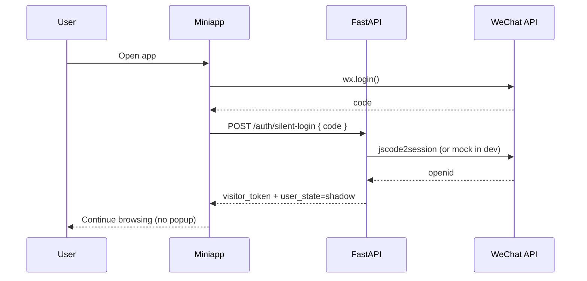

# Frontend and Design Specification

## 1) Mini Program Directory Rules

- `pages/`: business pages (`home`, `announcements`, `adjustments`, `detail`, `status`)
- `utils/`: API and utility wrappers
- `utils/config.js`: environment-aware miniapp runtime config
- `app.js`: global silent login bootstrap
- `app.json`: route and window setup
- `app.wxss`: global style tokens

## 2) Design Tokens

Use consistent visual tokens for a clean MVP:

- Primary: `#14532d`
- Secondary: `#0b4da2`
- Background: `#f5f7fa`
- Card background: `#ffffff`
- Title text: `#1f2d3d`
- Muted text: `#6b7785`

Spacing baseline:

- 4px / 8px grid via `rpx` multiples.
- Card paddings default `20rpx`.
- Page paddings default `24rpx`.

## 3) UX Flow Rules

- First open:
  - Do not show authorization popup.
  - Trigger `wx.login` silently.
  - Continue browsing even when silent login fails.
- Query flow:
  - User can search announcements/adjustments without explicit login.
  - Query pages support `refresh` as optional best-effort.
- Error flow:
  - Route to `/pages/status/index` with concise error message.
  - Do not trap user in modal loops.

## 4) Silent Login Sequence

## 5) Frontend Engineering Conventions

- Keep API calls in `utils/api.js`.
- Centralize runtime API base config in `utils/config.js`.
- Never hardcode auth popup logic in page entry lifecycle.
- Keep page data minimal and serializable.
- Use a dedicated detail page instead of long modal content.
