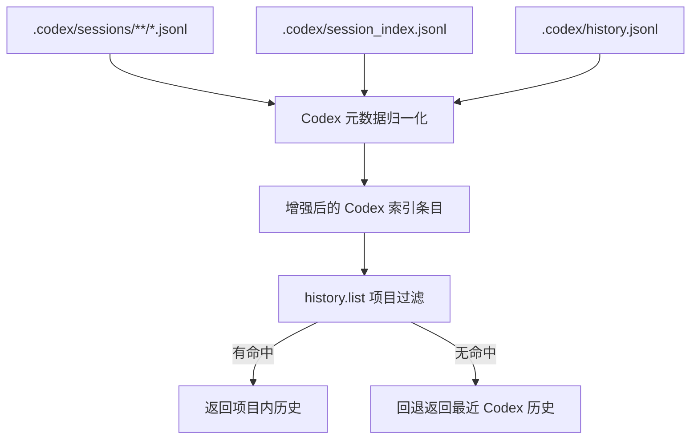

# CodexFlow 历史对话可见性修复设计

## 背景

用户希望本机部署的 CodexFlow 能看到“之前别的 API”产生的 Codex 历史对话。

当前现场证据显示：

- `C:\Users\17795\.codex\sessions\` 下共有 162 个 Codex 会话文件。
- `C:\Users\17795\.codexia\history.jsonl` 下也已有 162 条索引，说明 CodexFlow 已经做过一轮历史导入/索引。
- CodexFlow 当前把所有 Codex 会话统一标记为 `providerId = "codex"`，没有保留 `session_meta.payload.model_provider`（如 `cliproxyapi` / `cpa_legacy` / `openai`）这一层来源信息。
- CodexFlow 的 `history.list` 会先按当前项目路径（`projectWinPath` / `projectWslPath`）过滤索引历史；若过滤后为空，不再回退到全量历史。
- 当前 `C:\Users\17795\.codexia\settings.json` 中选中的 workspace 是 `C:\Users\17795\Desktop`，这会导致大量实际属于 `D:\codex\...` 的历史被过滤掉。

结论：当前问题不是“历史没导入”，而是“导入后的 Codex 历史缺少 API 元数据，且显示层被当前项目路径强过滤，导致用户看不到之前别的 API 对话”。

## 目标

让 CodexFlow 在不丢失当前项目内聚焦体验的前提下：

1. 能读取并保留 Codex 历史的真实 API 来源；
2. 能在当前项目无命中时回退显示已导入的旧历史，而不是返回空列表；
3. 能继续从 `C:\Users\17795\.codex\sessions\`、`C:\Users\17795\.codex\session_index.jsonl`、`C:\Users\17795\.codex\history.jsonl` 三个来源补齐/纠正 Codex 历史元数据。

## 非目标

- 不重做 CodexFlow 的整套历史页面 UI。
- 不新增复杂的历史筛选面板或跨 provider 管理系统。
- 不修改用户原始 Codex 会话文件内容。
- 不改 Claude / Gemini 的历史索引策略。

## 方案对比

### 方案 A：只补做历史导入

只继续扫描 `sessions/`、`session_index.jsonl`、`history.jsonl`，把缺失条目写回 `.codexia/history.jsonl`。

**优点：** 改动最小。

**缺点：** 当前现场已验证 `.codexia/history.jsonl` 与 `sessions/` 条数一致；只补导入无法解决“已导入但列表不显示”的问题。

### 方案 B：导入补齐 + Codex 元数据增强 + 显示层回退（推荐）

在现有索引器基础上：

- 从 Codex 会话头部解析 `model_provider`、`cwd`、`source` 等元数据；
- 让 Codex 历史条目增加 `subProvider`（真实 API 来源）；
- 让 `history.list` 在“当前项目过滤为空”时对已索引的 Codex 历史执行受控回退，而不是直接返回空。

**优点：** 同时解决“历史可见性”和“来源不可区分”两个问题；不要求用户手工切 workspace 才能看到旧对话。

**缺点：** 改动点横跨导入、索引、历史列表三层，复杂度高于方案 A。

### 方案 C：只改显示层，当前项目无命中时直接显示全量 Codex 历史

不额外做元数据补齐，只在 `history.list` 里回退到 `all`。

**优点：** 最快可见效。

**缺点：** 不能区分不同 API；后续仍无法准确说明“这是哪个 API 产生的历史”；诊断价值不足。

## 选定方案

采用 **方案 B**。

理由：当前问题本质上是“历史已导入，但来源信息丢失 + 列表被错误过滤”。只做导入没有价值，只做显示回退又会继续丢失 API 语义。方案 B 能以最小必要改动同时补齐这两个缺口。

## 设计

### 1. Codex 历史元数据补齐层

新增一个仅针对 Codex 的元数据提取与归一化流程，输入来源为：

- `C:\Users\17795\.codex\sessions\**\*.jsonl`
- `C:\Users\17795\.codex\session_index.jsonl`
- `C:\Users\17795\.codex\history.jsonl`

归一化后的每条记录至少包含：

- `sessionId`
- `filePath`
- `title`
- `preview`
- `cwd`
- `source`
- `originator`
- `modelProvider`（例如 `cliproxyapi` / `cpa_legacy` / `openai`）
- `updatedAt`

约束：

- `sessions/**/*.jsonl` 作为最可信来源；
- `session_index.jsonl` 用于补标题/更新时间；
- `history.jsonl` 用于补用户输入摘要；
- 若字段冲突，优先级为：`sessions` > `session_index` > `history.jsonl`。

### 2. 索引层增强

修改 CodexFlow 的 Codex 索引逻辑，使 Codex 条目不再只有固定的 `providerId = "codex"`，而是：

- `providerId` 仍保持 `codex`（兼容现有总分类）；
- 新增 `subProvider` 字段保存真实 API 来源；
- `dirKey` / `cwd` 优先使用会话元数据中的真实 `cwd`；
- `preview` / `title` 优先采用归一化元数据补齐结果。

这样可以保证：

- 历史列表仍把 Codex 视为一个大类；
- 但同类内部可区分 `cliproxyapi`、`cpa_legacy`、`openai`。

### 3. 历史列表过滤修复

修改 `history.list` 的 Codex 过滤策略：

1. 先按当前项目路径做现有的 `dirKey` 过滤；
2. 若有命中，保持现有行为，只返回项目内历史；
3. 若无命中：
   - 不直接返回空；
   - 改为回退到“最近的 Codex 已索引历史”，按时间倒序返回；
   - 保留 `subProvider` 与 `cwd`，让 UI 至少能展示出来源与项目路径。

这样既能保住项目内聚焦体验，又能避免用户在“当前 workspace 不对”时完全看不到已导入历史。

### 4. UI 最小改动

只做最小必要的展示增强：

- 若历史条目存在 `subProvider`，在条目附属信息中显示；
- 若条目来自回退模式，显示真实 `cwd` 或其简化路径，帮助用户判断为什么它会出现在当前列表里。

不新增单独的全局筛选器，不重做页面结构。

## 数据流

## 错误处理

- 任一辅助来源文件不存在时，历史功能仍可工作，只跳过该来源。
- 单个会话文件解析失败时，记录日志并跳过，不中断整个索引过程。
- `subProvider` 缺失时，回退为 `unknown`，但不影响条目显示。
- 当回退模式生效时，仍必须限制返回数量，避免一次性灌入过多历史。

## 测试策略

### 单元测试

覆盖以下行为：

1. 从 Codex session 头部提取 `model_provider` / `cwd` / `source`；
2. 三个来源合并时的优先级；
3. Codex 索引条目包含 `subProvider`；
4. `history.list` 在项目有命中时不回退；
5. `history.list` 在项目无命中时回退到最近 Codex 历史；
6. 回退模式下结果数量受 limit 控制。

### 手工验证

至少验证：

1. 当前 workspace 仍为 `Desktop` 时，历史列表不再空白；
2. 能看到之前 `cliproxyapi` / `cpa_legacy` / `openai` 产生的 Codex 历史；
3. 切换到真实项目后，项目内历史优先展示；
4. 旧通知流 `codexflow_after_agent_notify.jsonl` 不受影响。

## 风险

- 若“项目无命中时回退全局历史”做得过宽，可能带来噪音历史；因此必须限制在 Codex 历史、限制返回数量，并优先保持项目命中行为。
- 若直接修改已安装的 `app.asar`，升级时补丁会丢失；后续需要记录补丁步骤或形成可重复脚本。
- 若 UI 未显示 `subProvider`，即使底层已补齐，也会让用户误以为没有区分来源。

## 实施顺序

1. 先做 Codex 元数据归一化辅助层；
2. 再做 Codex 索引条目增强；
3. 再改 `history.list` 的空结果回退逻辑；
4. 最后补最小 UI 展示与手工验证。
